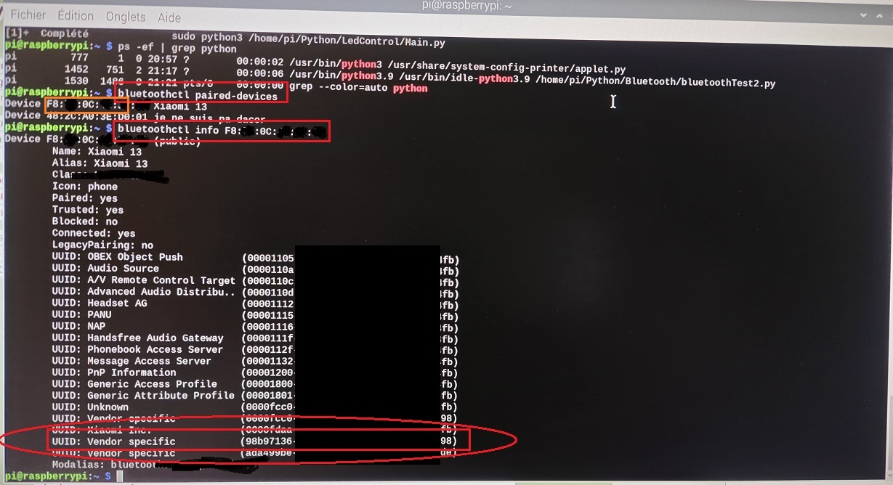

## 1. Connecter le téléphone au raspberry en bluetooth
## 2. Ajouter l'uuid du téléphone dans le code python (Main.py)
Pour connaitre l'uuid, voici les commandes à suivre :


``` bluetoothctl paired-devices ```


`bluetoothctl info <MA:CA:DD:RE:SS>`


Une liste de tous les uuid s'affiche, il faut en choisir un en particulier (je ne sais plus pourquoi il faut utiliser celui qui commence par un 9 dans mon cas).


### Image Example :


